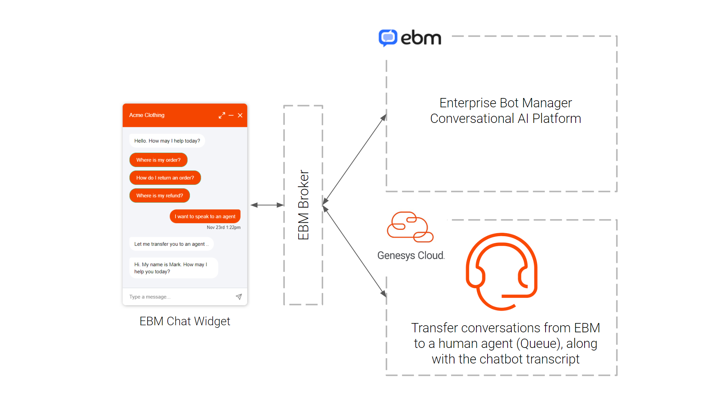

# Setup Guide for connecting EBM (Enterprise Bot Manager) to human agent handover  

This Genesys Cloud Developer Blueprint provides instructions on how to connect EBM (Enterprise Bot Manager) Chat Bots with Genesys Cloud, facilitating handover from chatbot to a human agent at appropriate points within a conversation.  In addition to checking agent availability, the connector passes chatbot transcripts to the agent at transfer. 

